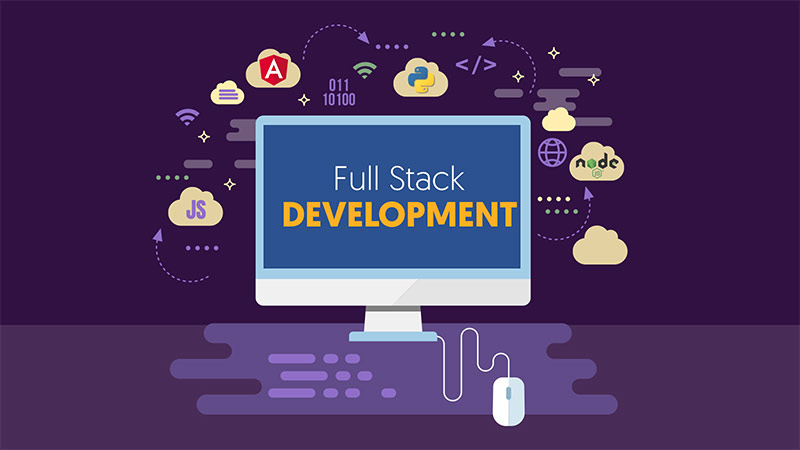

# The Portfolio of Ajay Chakaravarthy Antony Raj - Full Stack Developer 🚀

Welcome to my personal portfolio repository!  
This portfolio showcases my work, skills, and projects that reflect my journey as a Web Developer.  
Here, you'll find a variety of projects that highlight my abilities including front-end development, back-end integration, responsive design, and interactive animations.

---

## 📋 Table of Contents
- [About](#-about-)
- [Skills](#-skills-)
- [Features](#-features-)
- [Installation](#-installation-)
- [Contact](#-contact-)

---

## 👨‍💻 About
This portfolio was created to demonstrate my expertise and growth in web development.  
Each project provides a hands-on demonstration of different tools, technologies, and problem-solving techniques.  
I hope this portfolio gives you an insight into my approach to tackling challenges and creating impactful solutions.

---

## 🥷 Skills

### Languages 🛠️
- HTML5  
- CSS3  
- JavaScript  
- PHP  
- SQL  

### Frameworks & Libraries
- GSAP (GreenSock Animation Platform)  
- SASS/SCSS  

### Tools
- Git / GitHub  
- VS Code   

### Technologies
- MySQL Database  
- Responsive Design   
- Form Validation  

---

## 📋 Features
- ⚡️ Fully Responsive  
- ⚡️ Valid HTML5 & CSS3  
- ⚡️ GSAP Smooth Animations  
- ⚡️ Dynamic Content with PHP & MySQL  
- ⚡️ Interactive Contact Form  
- ⚡️ Mobile-First Design  

---
## Installation
- To run the portfolio locally:

- Clone this repository
Navigate into the project directory:

- Open the index.html file in your browser, or if using a local server, start the server and navigate to localhost to view.
---
## Contact
Feel free to reach out if you’d like to collaborate or have any questions!

LinkedIn: Ajay Chakaravarthy Antony Raj

Thank you for visiting my portfolio!