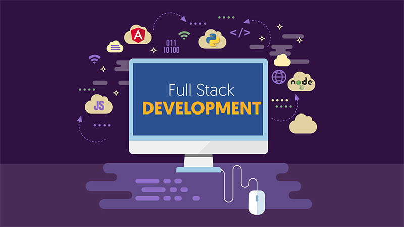

# Ajay Chakaravarthy Antony Raj — Portfolio 🚀

Hey there! I'm Ajay — a designer and developer who loves building things that look great and work even better. This portfolio is the result of two years of late nights, countless cups of coffee, and a genuine passion for interactive media design.



If you're a recruiter, employer, or just someone curious about my work — welcome. Take a look around.

🌐 **Live Site:** [https://ajayantonyraj.ca](https://ajayantonyraj.ca)  
📁 **GitHub:** [https://github.com/ajaymystic](https://github.com/ajaymystic)

---

## 📋 Table of Contents
- [About](#about)
- [Tech Stack](#tech-stack)
- [Features](#features)
- [Installation](#installation)
- [Admin Panel](#admin-panel)
- [Contact](#contact)

---

## 👨‍💻 About

I'm a Level 4 Interactive Media Design student at Fanshawe College with a focus on front-end development, motion design, and UI/UX. I build fast, responsive, and visually engaging web experiences.

This portfolio was built entirely from scratch — no templates, no Bootstrap, no shortcuts. Every animation, every component, every database query was written by hand.

---

## 🛠️ Tech Stack

**Frontend:**
- HTML5 (semantic markup)
- CSS3 + SASS/SCSS (modular, compiled to minified production file)
- JavaScript ES6+ (modular architecture)
- GSAP + ScrollTrigger (animations)

**Backend:**
- PHP 8.x
- MySQL (PDO with prepared statements)

**Tools:**
- Git / GitHub
- VS Code
- XAMPP (local development)

---

## ✨ Features

- ⚡️ Mobile-first responsive layout using a custom grid system
- 🎬 GSAP scroll animations and transitions
- 🗂️ Database-driven projects page (PHP + MySQL)
- 📬 AJAX contact form with real-time validation
- 🔐 Password-protected admin panel (CMS)
- 🧩 ES6 module architecture
- 🎨 SASS with partials compiled to minified CSS
- 🍔 Animated hamburger mobile menu
- 💬 Testimonials slider with keyboard navigation

---

## ⚙️ Installation

To run this portfolio locally:

1. Clone this repository:
```bash
git clone https://github.com/ajaymystic/AjayChakaravarthy_AntonyRaj_Portfolio.git
```

2. Move the project folder into your XAMPP `htdocs` directory

3. Import the database:
   - Open phpMyAdmin
   - Create a database called `ajay-portfolio`
   - Import the SQL schema (tables: projects, categories, users, contacts, testimonials)

4. Update `includes/classes/Database.php` with your local credentials

5. Start Apache and MySQL in XAMPP

6. Visit `http://localhost/Portfolio-Final`

---

## 🔐 Admin Panel

The portfolio includes a password-protected CMS admin panel at `/admin/login.php` that allows you to:

- ➕ Add new projects
- ✏️ Edit existing projects
- 🗑️ Delete projects
- 📋 View all submissions from the contact form

---

## 📬 Contact

Have a project in mind? Let's talk!

- 📧 Email: [contact.ajayantony@gmail.com](mailto:contact.ajayantony@gmail.com)
- 💼 LinkedIn: [ajayantonyraj](https://www.linkedin.com/in/ajayantonyraj/)
- 🐙 GitHub: [ajaymystic](https://github.com/ajaymystic)

---

*Built with ❤️ by Ajay Chakaravarthy Antony Raj — Fanshawe College, Interactive Media Design, 2026*